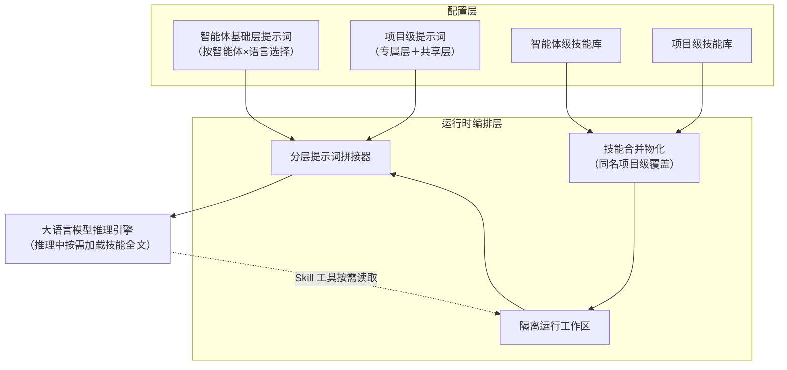

# 说明书摘要

本发明公开了一种基于分级技能包与分层提示词编排的多智能体服务方法及系统，属于人工智能技术领域。该方法维护智能体级与项目级两级技能注册表，技能以含元描述文件的技能包目录形式经安全校验后入库；响应智能体运行请求创建隔离工作区，将两级技能按同名项目级覆盖的规则合并物化到约定目录；并按智能体基础层、运行时上下文段、项目级附加段、技能可用性菜单段、回复语言指令段的确定性顺序拼接系统提示词，菜单段仅注入技能名称与描述，指示大语言模型在推理中按需加载技能全文。还提供依据项目是否关联代码仓库播种差异化默认提示词的幂等播种机制及热更新机制，降低了上下文占用与提示词维护成本，提升了回答的项目相关性。

## 摘要附图（图 1）

