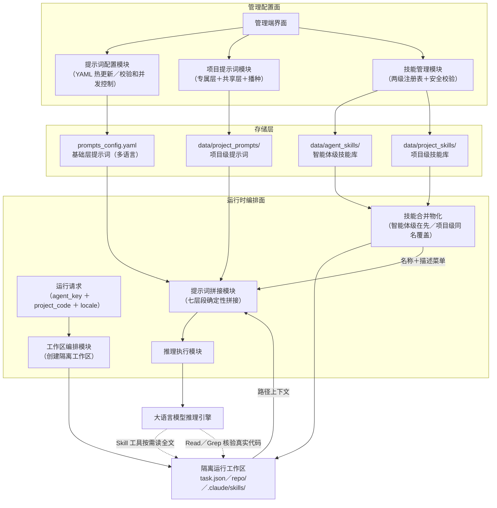
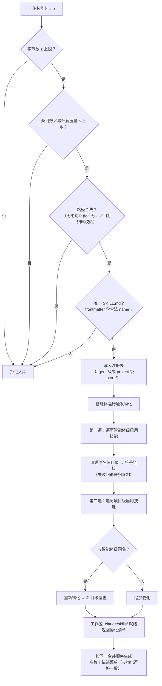
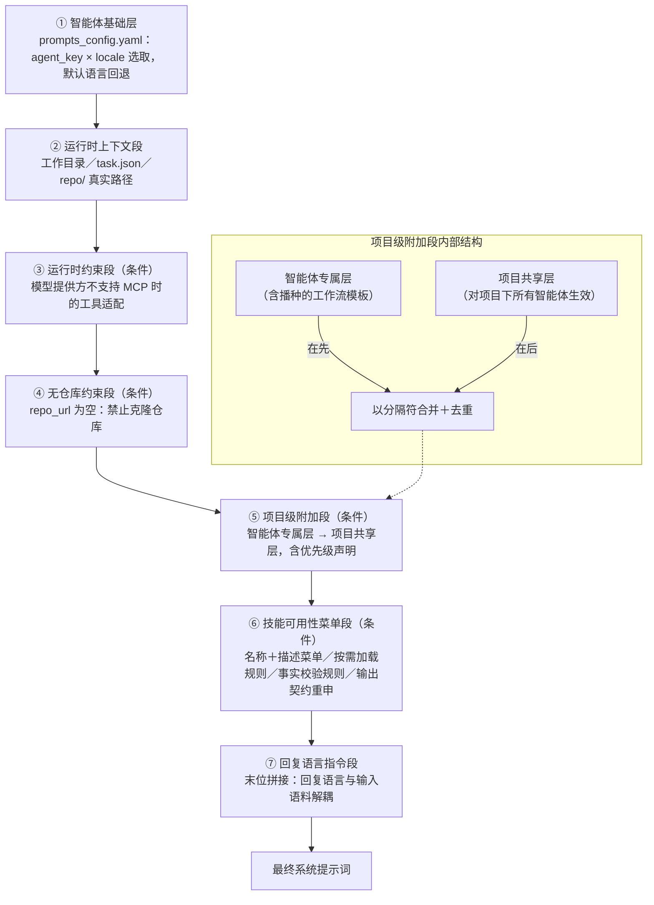
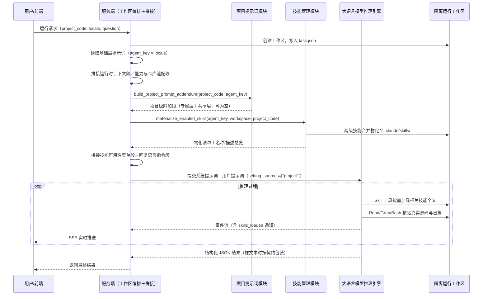
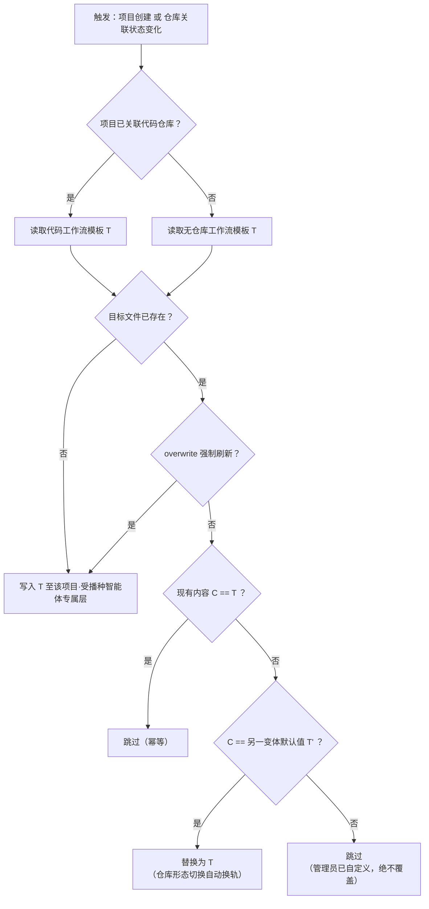
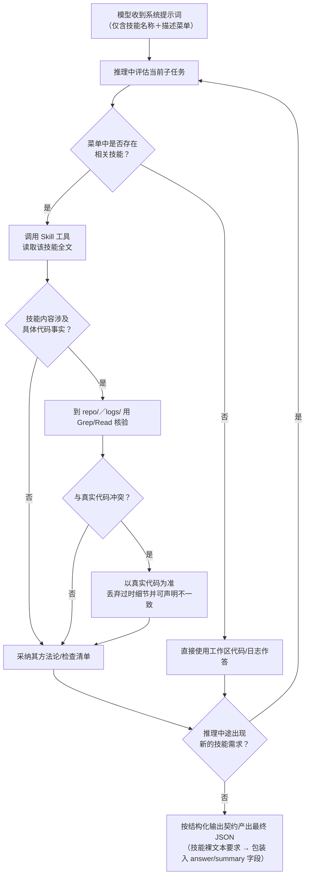
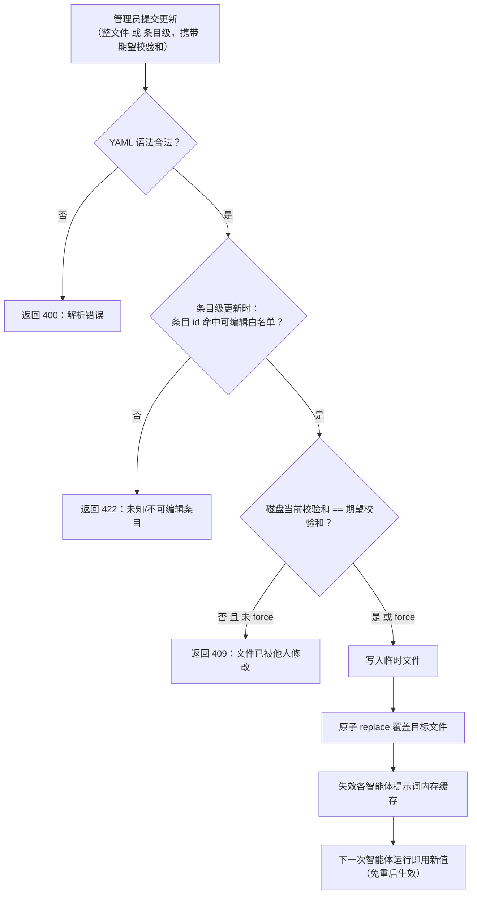

# 说明书附图

**发明名称：一种基于分级技能包与分层提示词编排的多智能体服务方法、系统、电子设备及存储介质**

以下各图以 Mermaid 源码形式提供，可直接渲染为矢量附图；正式提交时按 CNIPA 要求导出为黑白线条图。

---

## 图 1　多智能体服务系统总体架构图

---

## 图 2　两级技能包存储、校验与合并物化流程图

---

## 图 3　分层系统提示词确定性拼接顺序示意图

---

## 图 4　智能体运行全流程时序图

---

## 图 5　默认提示词幂等播种决策流程图

---

## 图 6　推理过程中技能按需加载流程图

---

## 图 7　提示词热更新与并发控制流程图

