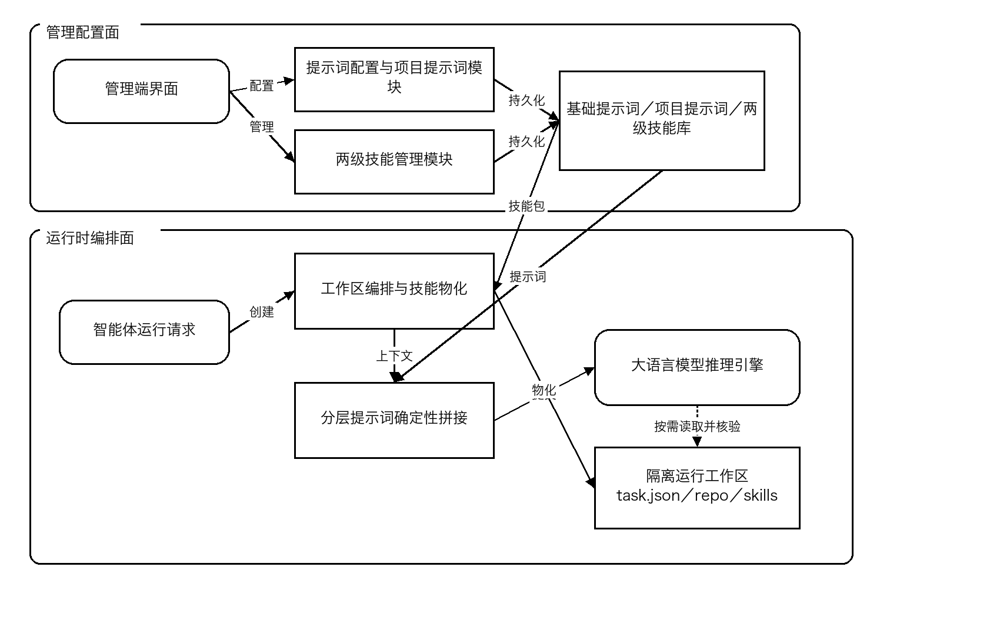
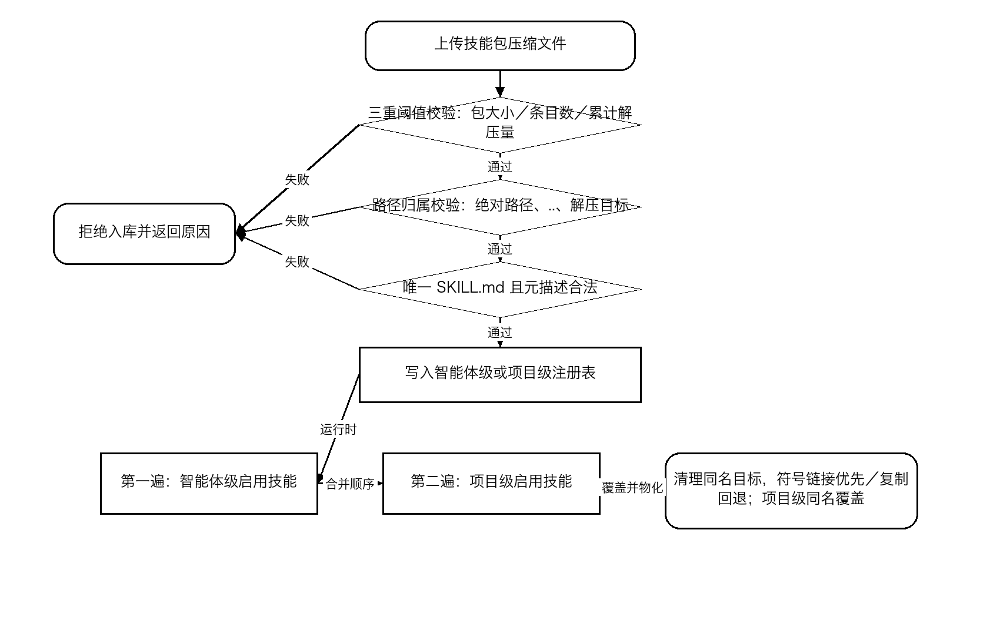
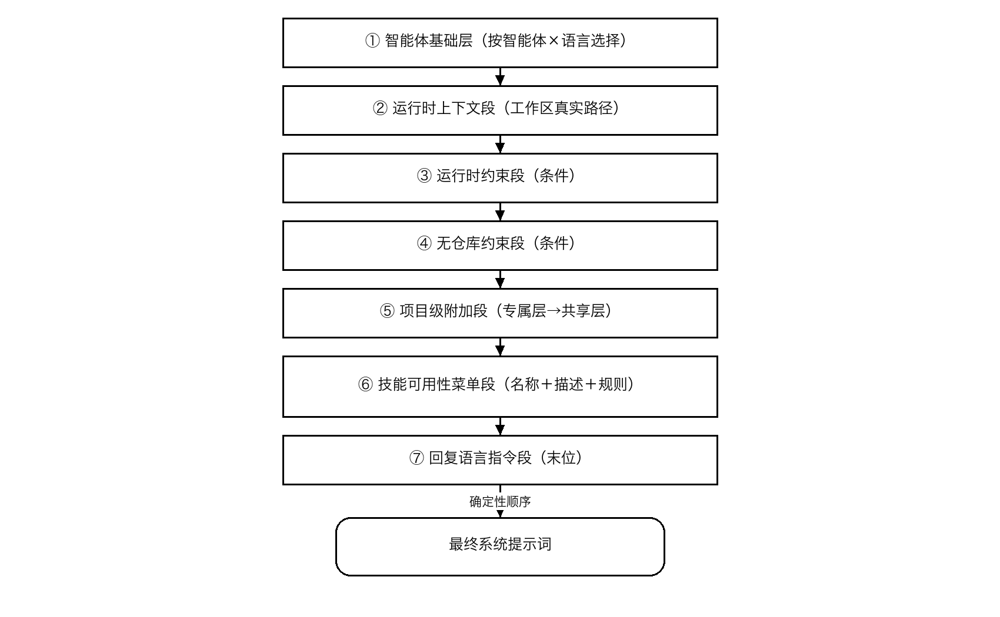
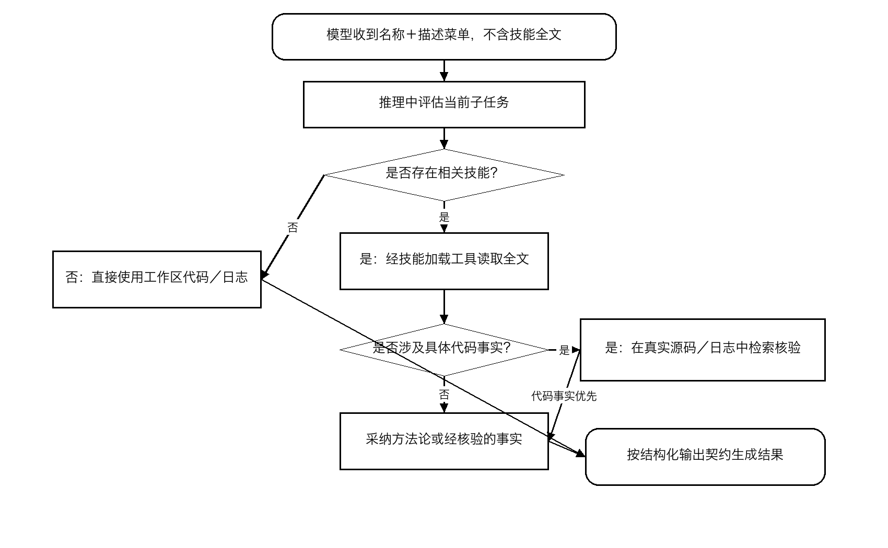
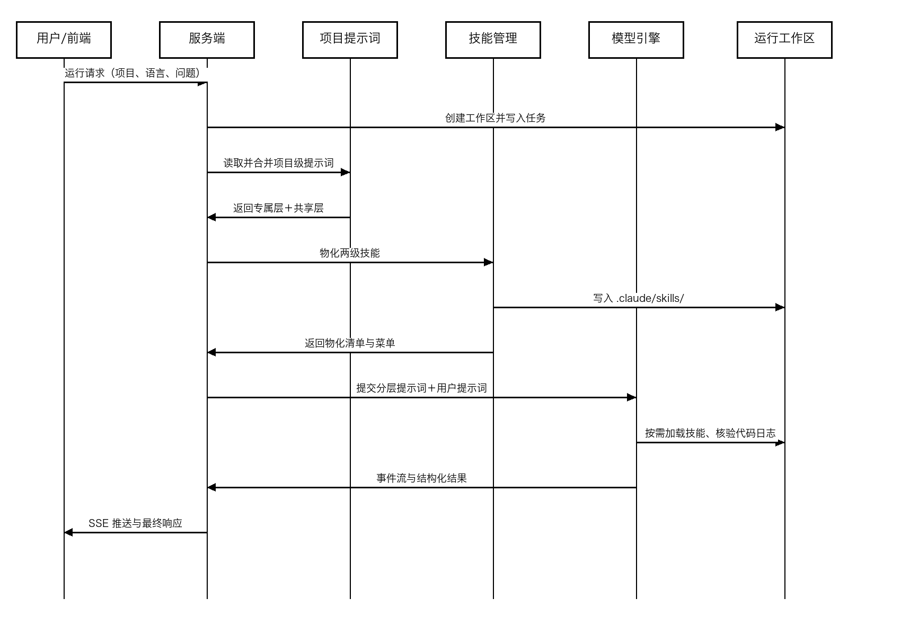
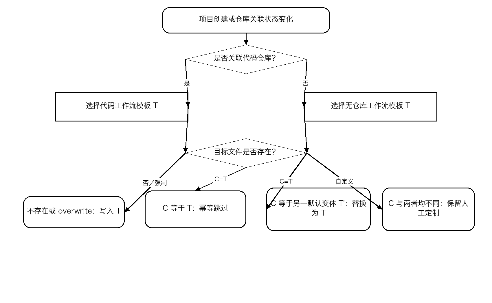
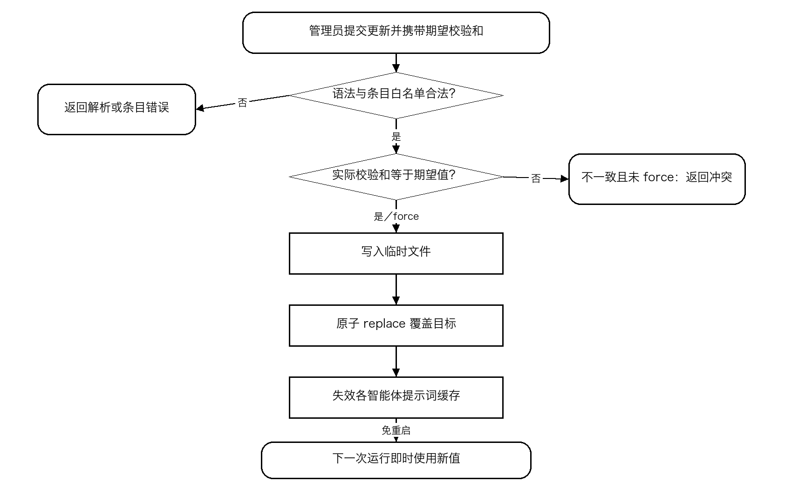

# 专利技术交底书

## 必填基础信息：

<table style="width:98%;">
<colgroup>
<col style="width: 30%" />
<col style="width: 67%" />
</colgroup>
<tbody>
<tr>
<td style="text-align: center;"><strong>专利名称</strong></td>
<td style="text-align: left;">一种基于分级Skills包与分层提示词编排的多智能体服务方法和系统</td>
</tr>
<tr>
<td style="text-align: center;"><strong>发明人（设计人）</strong></td>
<td style="text-align: left;">郭亮</td>
</tr>
<tr>
<td style="text-align: center;"><strong>申请人</strong></td>
<td style="text-align: left;">公司：银河航天</td>
</tr>
<tr>
<td rowspan="3" style="text-align: center;"><strong>技术联系人（一人）</strong></td>
<td style="text-align: left;">姓名：郭亮</td>
</tr>
<tr>
<td style="text-align: left;">电话：15901519969</td>
</tr>
<tr>
<td style="text-align: left;">E-mail：guoliang@yinhe.ht</td>
</tr>
<tr>
<td style="text-align: center;"><strong>专利所属项目名称及编号</strong></td>
<td style="text-align: left;"></td>
</tr>
</tbody>
</table>

## 1、本专利要解决的技术问题是什么？

本发明面向以项目为组织单元、由多个大语言模型智能体协同工作的服务端系统，拟解决以下能够由本发明技术方案直接解决的技术问题：

1.  多项目、多智能体场景下，领域知识缺乏层级化的归属、隔离和覆盖机制。

2.  传统做法在推理前将全部领域知识全文拼入上下文，导致上下文窗口被无关内容占用、Token消耗上升、模型注意力被稀释。

3.  系统提示词独立维护（比如编程智能体只有编程相关的系统提示此）的场景下无法灵活扩展，智能体通用角色、项目专属约束、工具能力限制和回复语言相互纠缠，难以确定优先级，也难以独立更新和维护。

4.  提示词配置存在多管理员并发覆盖、半写入文件和修改后必须重启才能生效的问题，缺少可预览、可校验、可热更新的配置控制机制。

5.  不同模型提供方、不同项目仓库形态具有不同的工具能力；如果不在运行时适配，模型会收到不可执行的工具指令或在无仓库项目中错误克隆代码。

6.  Skills知识可能落后于当前源码或日志，且Skills要求的裸文本输出可能破坏平台既定结构化输出契约，需要同时保证事实以真实工作区为准和最终输出格式稳定。

## 2、介绍技术背景,并描述已有的与本专利最相近似的实现方案。

### 2.1 技术背景

随着大语言模型（Large Language Model，LLM）技术发展，智能体被广泛用于日志根因分析、代码问答、缺陷修复、软件包检索和设备联动等企业级任务。实际平台通常同时承载多个业务项目与多个专业智能体。不同项目具有各自的代码仓库、日志格式、术语、流程与排障经验；不同智能体又具有不同角色、工具集合、权限边界和输出契约。

为使通用模型执行专业任务，系统通常需要同时向模型提供行为指令和领域知识。行为指令一般写入系统提示词，领域知识则以文档、知识库、检索片段或工具资源的形式提供。随着项目和智能体数量增加，知识与指令的数量、归属、覆盖关系、更新频率和安全边界会迅速复杂化。

在以项目为组织单元的智能测试平台中，一次运行还会动态创建工作区，写入任务描述，准备代码仓库、日志与设备上下文，并按模型提供方能力挂载不同工具。因此，静态配置与单次运行事实必须在运行时组合，且组合结果需要可预测、可复现。

### 2.2 现有常见实现方式

1.  单体提示词方案：将角色、项目知识、排查经验、格式要求和路径说明写入一段固定系统提示词；多项目共用时容易相互污染，任何局部变化都需要修改整体。

2.  全量知识注入方案：把所有知识文档在每次推理前拼入初始上下文；实现简单，但上下文成本与知识总量成正比，无关知识持续占用模型注意力。

3.  服务端预筛方案：由关键词匹配、向量检索或规则在推理前选出“可能相关”的知识片段并注入；该方案增加索引和检索维护，且不能覆盖推理过程中才出现的新知识需求。

4.  扁平知识库方案：全部智能体和项目共享一个Skills池，仅靠命名或标签区分；无法形成项目级隔离、覆盖和生命周期管理。

### 2.3 与本发明最接近的组合式方案

与本发明最接近的实现可概括为“集中式系统提示词＋扁平Skills目录＋服务端检索预筛”：服务端按智能体读取一段基础提示词；将所有项目知识放在同一目录或检索库；接收用户问题后先由关键词或向量检索选片段；把检索片段、运行路径和用户问题一次性提交模型；配置更新后重启服务。该组合已经具备提示词、知识和工具调用的基本能力，但没有两级Skills归属和同名覆盖规则，没有分层提示词的确定性顺序，也没有让模型在推理中依据菜单自行加载全文的机制。

本交底书对现有技术的描述采用上述技术类别和组合流程。具体专利、论文或公开产品文献编号可由代理人在正式检索阶段补充，不影响本交底书对技术方案的充分公开。

## 3、现有技术的缺点是什么？针对这些缺点，说明本专利的目的。

| **现有技术缺点** | **本发明对应目的** |
|:---|:---|
| 扁平Skills池不能隔离项目知识，也不能表达项目级覆盖通用Skills。 | 建立智能体级和项目级两级注册表，运行时按智能体级在先、项目级在后合并，同名项目级覆盖。 |
| 全量注入使初始上下文随Skills全文总量增长；服务端预筛会漏选。 | 初始上下文只注入名称和描述菜单，由模型在推理过程中按需加载相关Skills全文。 |
| 单体提示词混合通用、项目与运行时指令，优先级不确定。 | 按固定层段和固定顺序编排基础层、运行时层、项目层、Skills菜单与语言指令。 |
| 新项目从零配置；仓库形态切换时默认工作流失配。 | 按是否关联仓库选择模板进行幂等播种，同时识别并保护管理员自定义内容。 |
| 并发编辑相互覆盖、写入中断产生半文件、更新需重启。 | 采用期望校验和、原子替换、缓存失效和静态拼接预览。 |
| 上传压缩Skills包可能造成解压炸弹或目录穿越。 | 在入库前进行包大小、条目数、累计解压量、路径归属和元描述合法性校验。 |
| Skills中的代码事实可能过时，Skills输出格式可能破坏平台契约。 | 要求模型先以真实源码/日志核验具体事实，并将Skills裸文本包装入结构化输出字段。 |

因此，本发明的总体目的不是简单增加一份提示词或知识库，而是在知识治理、运行时投放、提示词编排和配置控制之间建立一套可执行、可验证且可扩展的协同机制，使项目专属能力可覆盖通用能力，使上下文按实际推理需求占用，并使配置变化安全即时地作用于后续运行。

## 4、本专利技术方案的详细阐述。（重点内容，请详细提供）

本发明的总体构思是在知识维度建立“智能体级／项目级”两级Skills包体系并在运行时合并物化，在指令维度建立“基础层／运行时层／项目层／Skills菜单层／语言层”分层提示词体系并按确定性顺序拼接，同时将Skills相关性判定从服务端推理前预筛移至大语言模型推理过程中的按需加载。

### 4.1 核心术语与对象

| **术语** | **定义** |
|:--:|:---|
| 智能体标识 agent_key | 服务端中唯一标识一种专业智能体的键，用于隔离基础提示词、智能体级Skills和运行配置。 |
| 项目标识 project_code | 唯一标识一个业务项目的键，用于隔离项目提示词、项目级Skills、仓库信息和运行数据。 |
| Skills包 Skill | 以目录组织的领域知识单元，至少包含 SKILL.md；还可包含脚本、模板、参考资料等。 |
| 结构化元描述头 frontmatter | SKILL.md 头部的结构化键值块，至少含 name 和 description，用于注册、校验和生成菜单。 |
| 物化 materialization | 将中心Skills包投放到一次运行工作区约定目录的过程，优先符号链接，失败时复制。 |
| 隔离运行工作区 | 与单次运行绑定的目录，包含任务文件、源码、日志、设备上下文及 .agents/skills/。 |
| 项目级附加段 | 由项目下智能体专属层和项目共享层合并得到的项目特定系统指令。 |
| Skills可用性菜单段 | 只列出已物化Skills的名称、描述、路径和使用规则，不包含Skills全文。 |

### 4.2 系统总体架构

如图1所示，系统由管理配置面、持久化存储和运行时编排面组成。管理配置面负责基础提示词、项目提示词和两级Skills包的维护；存储层分别保存提示词配置、项目级提示词目录、智能体级Skills库和项目级Skills库；运行时编排面接收智能体运行请求，创建隔离工作区，物化Skills，拼接提示词并调用模型推理。

| **模块** | **主要功能** |
|:--:|:---|
| Skills管理模块 | 维护两级注册表；完成上传、校验、启停、更新、物化和名称描述总览。 |
| 提示词配置模块 | 维护按智能体和语言组织的基础提示词，提供校验和并发控制、原子写入、缓存失效和预览。 |
| 项目提示词模块 | 维护项目共享层与智能体专属层，执行两层合并和差异化默认播种。 |
| 工作区编排模块 | 为每次运行创建隔离目录，准备任务、仓库、日志和约定Skills目录。 |
| 提示词拼接模块 | 按确定性顺序组装基础层、动态约束、项目附加段、Skills菜单和语言指令。 |
| 推理执行模块 | 提交提示词和用户输入，向模型提供Skills加载与工作区读取能力，并流式返回事件。 |

图1 多智能体服务系统总体架构图

### 4.3 两级Skills包存储、校验与合并物化

服务端维护智能体级Skills注册表和项目级Skills注册表。前者按 agent_key 隔离，用于某类智能体可跨项目复用的通用Skills；后者按 project_code 隔离，用于目标项目专属知识。两个层级具有平行目录结构，各自含注册表文件与按Skills名称组织的 store 目录。

> data/agent_skills/\<agent_key\>/\_registry.json
>
> data/agent_skills/\<agent_key\>/store/\<skill_name\>/SKILL.md
>
> data/project_skills/\<project_code\>/\_registry.json
>
> data/project_skills/\<project_code\>/store/\<skill_name\>/SKILL.md

每条注册记录至少包含Skills标识、名称、描述、启用状态、目录名、来源文件名、体积、安装时间和更新时间。名称与描述来自 SKILL.md 的结构化元描述头；enabled 为真时才参与运行时物化。

| **安全校验项** | **示例规则** | **防御目标** |
|:--:|:---|:--:|
| 压缩包字节数 | 不超过第一阈值，例如50 MB | 拒绝超大上传 |
| 归档条目数 | 不超过第二阈值，例如1000条 | 阻断海量小文件型解压炸弹 |
| 累计解压字节数 | 不超过第三阈值，例如200 MB | 阻断高压缩比型解压炸弹 |
| 归档路径 | 拒绝绝对路径和包含 .. 的路径；resolve 后必须属于目标目录 | 阻断目录穿越 |
| Skills描述文件 | 有且仅有一个有效 SKILL.md 根 | 拒绝畸形Skills包 |
| Skills名称 | 匹配 ^\[A-Za-z0-9\]\[A-Za-z0-9\_-\]{0,63}\$ | 避免非法目录名与注入 |
| 噪声项 | 忽略 \_\_MACOSX、.git、.DS_Store、.\_\* 等 | 降低无关文件和审计噪声 |

响应运行请求后，系统在工作区创建 .agents/skills/ 目录。第一遍遍历目标智能体的启用Skills，第二遍遍历目标项目的启用Skills；每次物化前清理同名文件、目录或符号链接，优先创建指向中心Skills目录的符号链接，失败时回退为递归复制。第二遍遇到同名Skills时重新物化，因而自然形成项目级覆盖智能体级。

1.  创建或确认工作区约定Skills目录存在。

2.  按注册表顺序遍历智能体级启用Skills并物化，记录已物化名称。

3.  按注册表顺序遍历项目级启用Skills；同名目标先清理再物化，实现项目级覆盖。

4.  以与物化相同的合并顺序生成名称与描述总览，确保菜单宣告集合和实际目录严格一致。

5.  存在Skills时向模型运行配置注入项目设置源，使模型可从工作区自动发现Skills。

图2 两级Skills包存储、校验与合并物化流程图

### 4.4 分层系统提示词的确定性拼接

系统不把所有指令拼成一段不可审计文本，而是按下表固定顺序组合。条件层段在条件不成立时为空，不改变其余层段的相对顺序。回复语言指令始终位于末位，使回复语言不受用户上传日志、代码注释或资料语言影响。

| **序** | **层段** | **来源** | **条件** | **内容** |
|:--:|:--:|:---|:--:|:---|
| 1 | 智能体基础层 | 提示词配置：agent_key×locale | 必选 | 角色、工具规范、输出契约；缺少语言时回退默认语言 |
| 2 | 运行时上下文段 | 本次工作区 | 必选 | 工作目录、任务文件、源码和日志真实路径 |
| 3 | 运行时约束段 | 模型提供方能力探测 | 条件 | 不支持外部工具协议时的过滤与替代路径 |
| 4 | 无仓库约束段 | 项目仓库状态 | 条件 | 无仓库时禁止克隆，改用项目提示词与Skills |
| 5 | 项目级附加段 | 专属层＋共享层 | 条件 | 项目特定约束和优先级声明 |
| 6 | Skills可用性菜单段 | 物化清单＋描述 | 条件 | 名称、描述、路径、按需加载、事实校验、输出契约 |
| 7 | 回复语言指令段 | 请求 locale | 必选 | 末位指定最终回复语言 |

项目级附加段先读取目标项目下与 agent_key 对应的智能体专属层，再读取对项目内所有智能体生效的共享层；专属层在先、共享层在后，中间使用预设分隔符。两层内容相同则共享层去重；两层都为空则整个附加段为空。非空时在正文前加入项目名称和优先级声明，说明项目约束在不违背安全底线与最终输出格式的前提下优先于通用指令。

> data/project_prompts/\<project_code\>/system_prompt.md \# 项目共享层
>
> data/project_prompts/\<project_code\>/\<agent_key\>/system_prompt.md \# 智能体专属层

项目提示词单层设置字符上限以避免异常大文件拖垮上下文；agent_key 必须命中白名单，该白名单同时构成路径白名单。项目提示词按运行读取，不依赖长期缓存，因此项目级编辑可直接作用于后续运行。

图3 分层系统提示词确定性拼接顺序示意图

### 4.5 Skills菜单驱动的推理中按需加载与事实校验

Skills可用性菜单段不注入Skills全文。对每个已物化Skills仅生成一行“名称＋描述＋物化路径”，并附带三组规则。第一组为按需加载规则：模型使用Skills前必须通过Skills加载工具读取全文，推理中途可根据新出现的子任务继续加载，无关Skills不得加载。第二组为事实校验规则：Skills是方法论和经验的辅助来源，涉及文件路径、符号、字段、枚举、接口签名、行号和调用关系的具体描述必须先在当前工作区的真实源码或日志中检索核验，冲突时以真实事实为准。第三组为输出契约规则：Skills要求的裸文本不能直接越过平台结构化输出契约，应包装到约定字段并记录包装标记。

模型获得菜单后，在推理中评估当前子任务是否与某Skills描述相关。相关时才读取该Skills全文；若全文只提供方法论或检查清单，可直接按方法论执行；若包含具体代码事实，则继续访问 repo/ 或 logs/ 核验。这样，相关性判定利用模型已经形成的中间推理状态，克服推理前服务端预筛无法预测后续需求的问题。

图6 推理过程中Skills按需加载流程图

### 4.6 智能体运行全流程

1.  服务端接收含 project_code、agent_key、locale 和用户问题的运行请求，创建隔离运行工作区并写入 task.json。

2.  按 agent_key×locale 读取基础层提示词；缺少目标语言时回退至默认语言。

3.  拼接工作区、任务文件、源码目录和日志目录的真实路径上下文。

4.  探测模型提供方能力；不支持外部工具协议时过滤对应工具并注入替代约束。

5.  检查项目仓库信息；repo_url 为空时注入禁止克隆仓库的无仓库约束。

6.  读取并合并项目智能体专属层与项目共享层，生成项目级附加段。

7.  按智能体级在先、项目级在后物化启用Skills，取回与物化结果一致的名称和描述总览。

8.  生成Skills菜单，拼接回复语言指令，构建工作目录、允许工具、权限模式和外部工具服务等运行选项。

9.  将系统提示词与用户提示词提交模型；推理中模型按需加载Skills，并以 Read、Grep 或等价工具核验真实源码与日志。

10. 服务端将思考、工具调用、Skills加载通知和输出事件流推送前端；结束时返回符合结构化契约的结果。

图4 智能体运行全流程时序图

### 4.7 默认提示词的差异化幂等播种

项目创建或项目与代码仓库的关联状态发生变化时触发播种。系统根据是否存在可用仓库，在代码工作流模板和无仓库工作流模板之间选择当前模板 T；另一形态的默认模板记为 T'，目标文件现有内容记为 C。

|      **条件**       |  **动作**  |         **作用**         |
|:-------------------:|:----------:|:------------------------:|
|   目标文件不存在    |   写入 T   |       新项目冷启动       |
|      C 等于 T       |    跳过    |     重复触发无副作用     |
|      C 等于 T'      |  替换为 T  |  仓库形态切换时自动换轨  |
|  C 与 T、T' 均不同  |    跳过    | 识别为管理员自定义并保护 |
| 显式 overwrite=true | 强制写入 T |  管理员主动刷新默认模板  |

受播种智能体集合可以配置。一个实施例中仅项目专家智能体受播种：日志分析和包检索智能体的代码工作流已内置在各自基础层，而项目专家的基础层保持与仓库无关，代码工作流下沉到项目专属层。由此，同一智能体在不同项目呈现不同工作流，而基础提示词仍保持单一通用来源。

图5 默认提示词幂等播种决策流程图

### 4.8 提示词热更新、并发控制与拼接预览

基础层提示词可集中存储为按“功能键→智能体变体→字段→语言”组织的配置。更新请求携带调用方读取时获得的期望校验和；服务端在写入前重新计算磁盘实际校验和。若两者不一致且未指定强制标志，则拒绝更新，避免后提交者静默覆盖先提交者。

通过校验后，服务端先把完整新内容写入同目录临时文件并完成解析校验，再以原子 replace 覆盖目标文件，避免进程中断留下半成品。成功后统一使各智能体提示词内存缓存失效，使下一次运行读取新内容而不需要重启。条目级更新还要求目标点路径命中可编辑白名单；整文件更新要求整体语法合法。

管理端可请求静态拼接预览。预览返回基础层与项目级附加段的组合文本，并分别返回 base、agent、shared 三层是否存在、字节数和更新时间；预览刻意排除工作区路径、能力约束、Skills菜单和语言指令等只在运行时才能确定的动态段，使管理员审查的是稳定的静态指令骨架。

图7 提示词热更新与并发控制流程图

### 4.9 运行时适配与输出契约保障

当目标项目未关联代码仓库时，系统注入禁止克隆仓库、禁止假设代码存在、应依据项目提示词、已启用Skills和用户上下文作答的约束。当模型提供方不支持外部工具协议服务时，系统从允许工具集中过滤对应前缀工具，并在提示词中说明不可用能力和替代访问方式。能力适配发生在提交推理之前，避免模型获得不可执行指令。

Skills菜单重申平台最终输出契约。例如平台要求返回含 status、answer、summary、related_keywords 等字段的结构化对象，而某Skills要求输出一段裸文本时，推理执行模块将该文本放入 answer 或 summary 字段，并增加 parse_warning 等包装标记；由此既保留Skills的语义结果，又不破坏调用方解析协议。

### 4.10 系统、电子设备与存储介质实现

上述方法可由Skills管理模块、提示词配置模块、项目提示词模块、工作区编排模块、提示词拼接模块和推理执行模块共同实现。模块既可部署在同一服务进程，也可分布式部署；注册表和提示词可以位于本地文件系统、共享文件系统、对象存储或数据库，只要保持两级逻辑隔离、确定性合并和原子更新语义。

电子设备至少包括处理器、存储器和网络接口。存储器保存计算机程序、提示词、注册表和Skills包；处理器执行程序时完成Skills校验、工作区创建、物化、提示词拼接、模型调用和结果处理。计算机可读存储介质可为磁盘、固态存储器、只读存储器、随机存取存储器或其他可保存程序指令的非瞬时介质。

### 4.11 定量实施例

以一个配置20个Skills、每个Skills全文平均8000字符、描述平均60字符的项目为例，现有全量注入方案的初始Skills上下文约为160000字符；本发明仅注入约1200字符的菜单和固定规则段，随后只加载模型判定相关的1至3个Skills。初始Skills相关占用下降约两个数量级。若20个Skills包总计50 MB，符号链接优先物化还可将每次运行的Skills投放从复制50 MB降低为创建20个链接。数值仅用于说明技术效果，不限制保护范围。

| **方案** |  **初始Skills相关占用**  | **实际全文加载** |    **运行时投放**    |
|:--------:|:------------------------:|:----------------:|:--------------------:|
| 全量注入 |       约160000字符       |     全部20个     |  复制或拼接全部内容  |
|  本发明  | 约1200字符菜单＋固定规则 |   相关的1至3个   | 20个链接或必要时复制 |

### 4.12 关键边界与一致性要求

1.  菜单中的Skills集合必须与工作区实际物化结果来自同一合并顺序，避免宣告存在但无法加载或已物化但菜单不可见。

2.  项目级提示词优先级不得越过安全约束和最终输出格式底线。

3.  项目级同名覆盖通过第二遍重新物化实现；任何缓存或索引均不得改变该覆盖结果。

4.  管理员自定义提示词的识别以内容同时不同于两种未修改默认模板为依据，自动播种不得覆盖该内容。

5.  Skills全文只能作为辅助知识来源；具体代码和日志事实必须以本次工作区真实内容为准。

6.  运行时条件段可以为空，但各层段的相对拼接顺序不得变化。

## 5、本专利的关键点和欲保护点是什么？

建议代理人在撰写权利要求时重点覆盖以下相互配合的技术特征，并避免把保护范围不必要地限定在具体目录名、具体模型供应商或特定编程语言：

1.  智能体级Skills注册表与项目级Skills注册表构成的两级Skills治理结构，以及按智能体标识、项目标识进行逻辑或物理隔离。

2.  响应运行请求创建隔离工作区，并按智能体级在先、项目级在后的顺序物化启用Skills；项目级同名Skills覆盖智能体级同名Skills。

3.  Skills包至少包含具有名称和描述字段的结构化元描述；名称和描述用于注册、校验和运行时菜单生成。

4.  系统提示词按基础层、运行时上下文、条件约束、项目附加段、Skills菜单和回复语言指令的确定性顺序构建。

5.  项目级附加段内部采用智能体专属层在先、项目共享层在后、相同内容去重、双空不拼接和优先级声明的组合规则。

6.  Skills菜单只注入已物化Skills的名称、描述和使用规则，不注入全文；模型在推理过程中依据菜单自行判断相关性并按需加载全文。

7.  Skills事实校验规则：Skills中的具体代码事实须以当前工作区真实源码或日志核验，冲突时真实事实优先。

8.  根据项目是否关联代码仓库选择不同默认模板，并通过当前模板、另一模板和现有内容三方比对实现幂等播种与人工定制保护。

9.  更新请求的期望校验和、临时文件写入、原子替换和缓存失效共同形成的提示词热更新控制链。

10. Skills包入库前的压缩包大小、条目数、累计解压量、路径归属、唯一描述文件和名称规则等组合安全校验。

11. 无仓库和模型提供方能力不足时的运行时适配，以及Skills裸文本按平台结构化输出契约包装的保障机制。

12. 实施上述方法的系统、电子设备和计算机可读存储介质。

其中，第1、2、4、6项共同形成最核心的发明构思：两级Skills在运行时确定性合并，模型只接收与实际物化一致的Skills菜单，并在推理过程中按需加载全文；其余特征可作为从属保护点增强治理、安全、可信度和配置可用性。

## 6、与第2条所属的最好的现有技术相比，本专利有何优点

与“集中式系统提示词＋扁平Skills目录＋服务端检索预筛”的最接近组合相比，本发明的优点由具体技术手段直接产生。

1.  初始上下文显著缩小。由于只注入名称和描述菜单，Skills全文不随每次请求无条件进入上下文；Skills越多，节省越明显，且模型注意力更集中。

2.  相关性判定更贴近真实推理需求。模型可在形成中间结论后再发现需要的Skills，减少推理前关键词或向量检索漏选造成的知识缺失。

3.  项目知识治理更明确。两级注册表和同名项目级覆盖把通用能力、项目特化和权限边界落实为可执行的存储与物化规则。

4.  提示词变化更可控。固定层段和固定顺序使通用指令、项目约束、动态事实和语言要求可以独立维护、预览与审计。

5.  项目冷启动和仓库形态切换自动化。双模板播种按状态切换默认值，同时通过三方比对保护人工修改。

6.  配置更新更安全及时。乐观并发控制防止相互覆盖，原子替换防止半文件，缓存失效使变更无需重启即可生效。

7.  Skills供应链风险降低。多重阈值、路径归属和元描述校验在解压与入库阶段阻断常见压缩包攻击。

8.  答案可信度和接口稳定性提高。代码事实以真实工作区核验，Skills输出仍受平台结构化契约约束。

9.  运行投放开销降低。符号链接优先避免为每次运行复制完整Skills包，同时保留不支持符号链接环境下的复制回退。

## 7、针对4中的技术方案，是否还有别的替代方案同样能完成发明目的？

存在若干等同或替代实现。下列替代不改变本发明的核心目的，建议在说明书和权利要求中以功能和关系表述，避免被具体载体规避：

1.  两级注册表可保存为 JSON、YAML、关系数据库、键值数据库或对象存储元数据；只要仍按智能体和项目隔离并支持启用状态、名称、描述和版本信息即可。

2.  Skills包可采用目录、压缩归档、对象存储前缀、内容寻址包或数据库大对象；结构化元描述可采用 YAML、JSON、XML 或独立清单文件。

3.  物化可采用符号链接、硬链接、绑定挂载、联合文件系统、写时复制、容器卷映射、对象下载或递归复制；项目级同名覆盖语义必须保持。

4.  项目级提示词可存于文件、数据库或配置中心；专属层和共享层也可扩展为更多层级，只要保留确定性优先级、去重和空层处理。

5.  基础层提示词可按语言映射、模板参数化或配置版本存储；回复语言可由末位指令或等价高优先级控制字段实现。

6.  Skills全文可通过专用 Skill 工具、通用文件读取工具、受控资源协议、检索接口或远程能力服务加载；核心在于初始菜单不含全文且模型能在推理中按需获取。

7.  相关性判断可由单一模型完成，也可由同一运行中的规划模型、子智能体或工具调用决策模块完成；只要判定发生在获得当前推理状态之后。

8.  热更新的版本标识可用哈希校验和、递增版本号、实体标签 ETag 或比较并交换事务；持久化可用原子重命名、数据库事务或配置中心事务。

9.  默认播种可在项目创建事件、仓库绑定事件、后台维护任务或首次运行时触发；管理员定制可通过内容比对、显式标志或版本元数据识别。

10. 模型提供方能力适配可通过工具白名单、能力协商、运行配置或提示词条件分支实现；外部工具协议并不限于 MCP。

11. 结构化输出可采用 JSON、XML、协议缓冲或预定义对象；裸文本包装字段名称可以变化，但不得绕过平台输出契约。

12. 系统可以单体部署、微服务部署、容器化部署或无服务器部署；工作区可以位于本地磁盘、网络文件系统或临时卷。

### 7.1 必不可少的结构或步骤

1.  存在至少两个具有不同归属范围的Skills层级，并在一次运行中按确定性规则合并，较窄范围的项目层可覆盖较宽范围的智能体层。

2.  系统提示词按预定层段组装，Skills可用性以与实际物化一致的名称和描述菜单呈现。

3.  Skills全文不在初始提示词中全量注入，模型或模型驱动的运行决策在推理过程中按需获取相关Skills全文。

### 7.2 可选增强结构或步骤

符号链接优先、具体目录名 .agents/skills/、YAML 配置、MCP 工具、SSE 流式传输、JSON 字段名、示例阈值、具体智能体清单、20个Skills的定量数据均属于实施例，可由等价技术替换，不应作为核心独立权利要求的必要限定。

## 8、其他有助于专利代理人理解本技术的资料

### 8.1 术语中英文对照

| **中文术语** | **英文／缩写** | **说明** |
|:--:|:---|:---|
| 大语言模型 | Large Language Model, LLM | 支持自然语言生成及工具调用的模型推理引擎 |
| 智能体 | Agent | 由模型、提示词、工具、权限和运行循环共同构成的任务执行单元 |
| 多智能体 | Multi-Agent | 同一平台内多个职责不同的智能体 |
| Skills包 | Skill Package | 含元描述、方法、脚本、模板和参考资料的知识目录 |
| 结构化元描述头 | Frontmatter | Skills描述文件头部的结构化元数据 |
| 物化 | Materialization | 将中心Skills包投放到单次运行工作区 |
| 上下文窗口 | Context Window | 模型一次推理能够接收的上下文容量 |
| 模型上下文协议 | Model Context Protocol, MCP | 本实施例中的一种外部工具协议示例，并非保护范围限定 |
| 服务器发送事件 | Server-Sent Events, SSE | 从服务端向前端单向流式推送运行事件的技术 |
| 乐观并发控制 | Optimistic Concurrency Control | 写入前比较版本或校验和，冲突时拒绝覆盖 |

### 8.2 附图清单

1.  图1：多智能体服务系统总体架构图。

2.  图2：两级Skills包存储、校验与合并物化流程图。

3.  图3：分层系统提示词确定性拼接顺序示意图。

4.  图4：智能体运行全流程时序图。

5.  图5：默认提示词幂等播种决策流程图。

6.  图6：推理过程中Skills按需加载流程图。

7.  图7：提示词热更新与并发控制流程图。

### 8.3 已有配套材料

1.  《01-说明书摘要.md》：发明摘要及摘要附图。

2.  《02-权利要求书.md》：15项方法、系统、电子设备和存储介质权利要求草案。

3.  《03-说明书.md》：技术领域、背景、发明内容、附图说明和七个实施例。

4.  《04-说明书附图.md》：图1至图7的可渲染 Mermaid 源码。

5.  RavenAIService 实现材料：Skills服务、项目提示词服务、智能体运行工作区与提示词编排相关源代码、配置和测试。

### 8.4 申请前待补充事项

1.  发明人（设计人）姓名及贡献排序。

2.  申请人公司全称、地址及申请主体信息。

3.  技术联系人姓名、电话和电子邮箱。

4.  项目正式名称与项目编号。

5.  如需主张优先权，补充相关首次公开、内部立项、版本发布日期及证明材料。

6.  由专利代理人结合检索结果补充最接近对比文件的专利或文献编号，并据此微调独立权利要求。

除上述待补充的主体和检索信息外，本交底书已给出本领域技术人员可据以实现的系统组成、数据组织、校验条件、合并顺序、提示词层次、运行流程、异常分支、替代方案和定量实施例。
