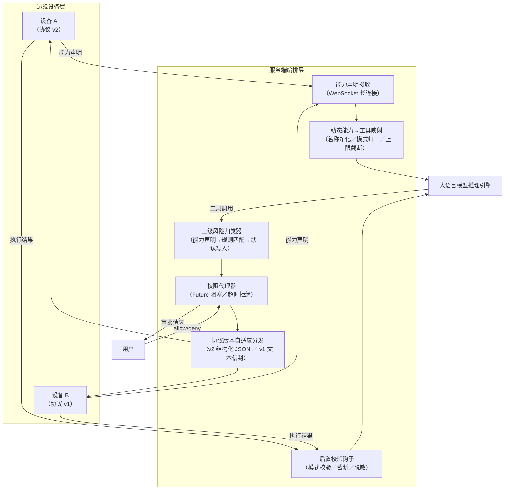

# 说明书摘要

本发明公开了一种基于动态能力映射与人机协同权限管控的AI智能体远程设备交互方法及系统，属于人工智能与物联网领域。该方法在设备经长连接注册时接收能力声明，将工具定义动态翻译为进程内代理工具注册至推理引擎；对工具调用按能力声明、规则匹配、默认写入三级优先级归类风险等级，只读自动放行，写入与破坏性工具经权限代理器向用户发起审批并阻塞推理循环直至裁决；执行结果经后置校验钩子做信封解析、模式校验、超限截断与凭证脱敏后方可回喂模型；还提供协议版本自适应分发与结构化选项的主动澄清提问机制，降低异构设备接入成本与误操作风险，提升安全性与可靠性。

## 摘要附图（图 1）

