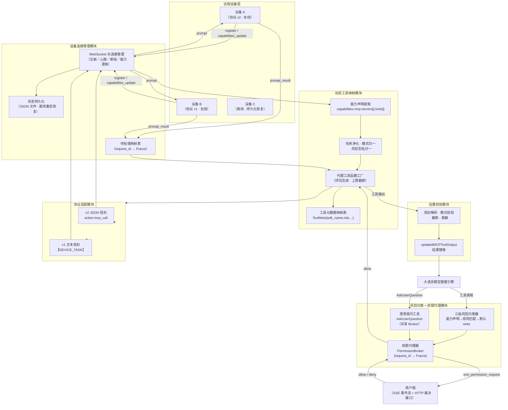
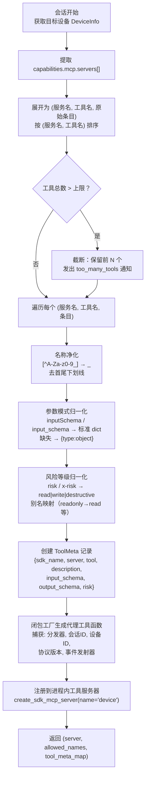
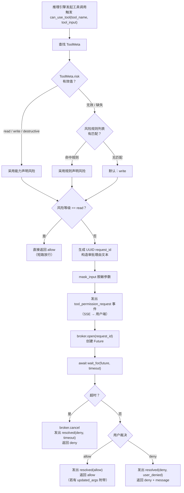
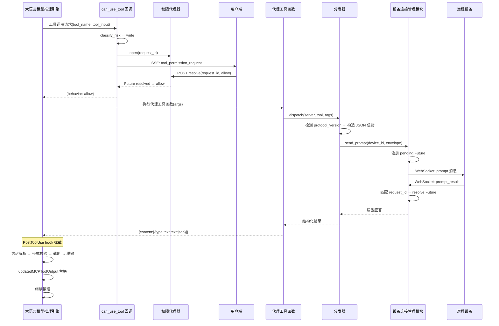
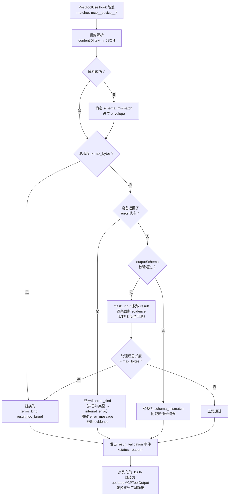
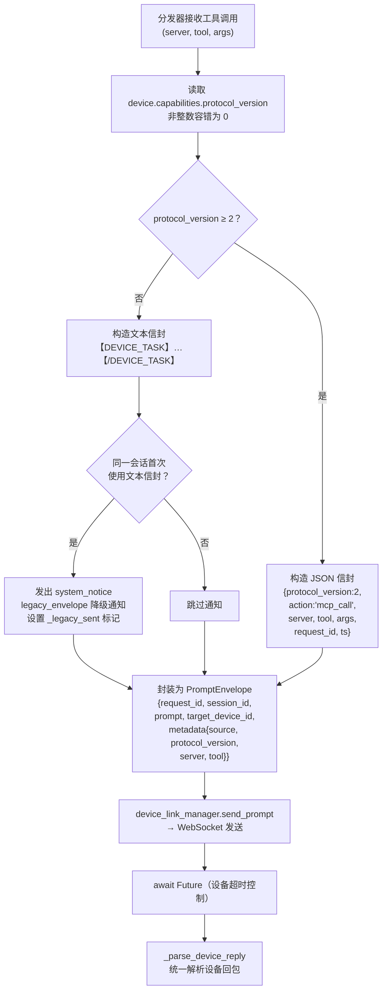
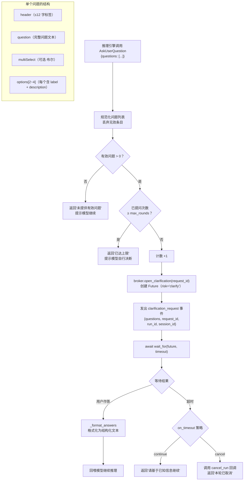

# 说明书附图

**发明名称：一种基于动态能力映射与人机协同权限管控的AI智能体远程设备交互方法、系统、电子设备及存储介质**

以下各图以 Mermaid 源码形式提供，可直接渲染为矢量附图；正式提交时按 CNIPA 要求导出为黑白线条图。

---

## 图 1　AI智能体远程设备交互系统总体架构图

---

## 图 2　动态能力→工具映射流程图

---

## 图 3　三级风险归类与人机协同权限管控流程图

---

## 图 4　单次设备工具调用全流程时序图

---

## 图 5　后置校验钩子处理流程图

---

## 图 6　协议版本自适应分发流程图

---

## 图 7　主动澄清提问流程图

---

## 图 8　设备连接生命周期与状态持久化流程图

```mermaid
flowchart TB
    subgraph LIFECYCLE["设备连接生命周期"]
        REG["register 消息到达<br/>（携带 device_id, capabilities, ...）"]
        REG --> OLD{"同 ID 旧连接存在？"}
        OLD -->|是| CLOSE_OLD["关闭旧 WebSocket"]
        OLD -->|否| CREATE
        CLOSE_OLD --> CREATE["创建/更新 DeviceState<br/>标记 online"]
        CREATE --> PERSIST1["持久化设备列表"]

        HB["心跳（ping/pong）"]
        HB --> UPDATE["更新 last_seen + online"]
        UPDATE --> PERSIST2["持久化设备列表"]

        DISC["WebSocket 断开"]
        DISC --> OFFLINE["标记 offline<br/>清空 WebSocket 引用"]
        OFFLINE --> FAIL["遍历待处理映射表<br/>以断连异常完成所有<br/>该设备的 pending Future"]
        FAIL --> PERSIST3["持久化设备列表"]

        CAP_UP["capabilities_update 消息"]
        CAP_UP --> UPD_CAP["更新 capabilities dict<br/>更新 last_seen"]
        UPD_CAP --> PERSIST4["持久化设备列表"]
    end

    subgraph RESTART["服务重启恢复"]
        BOOT["服务启动"]
        BOOT --> LOAD["读取 device_links.json"]
        LOAD --> RESTORE["逐条解析 DeviceInfo<br/>标记 offline（WebSocket=null）<br/>加入设备映射表"]
        RESTORE --> READY["恢复完成<br/>等待设备重新 register"]
    end

    subgraph PROMPT_MATCH["请求-响应匹配"]
        SEND["send_prompt(device_id, envelope)"]
        SEND --> REG_F["创建 Future<br/>注册到 pending 映射表"]
        REG_F --> WS_SEND["WebSocket 发送 prompt 帧"]
        WS_SEND --> WAIT_F["await wait_for(future, timeout)"]

        RECV["handle_prompt_result"]
        RECV --> MATCH["按 request_id 查找 pending"]
        MATCH --> CHECK_D{"device_id 一致？"}
        CHECK_D -->|否| WARN["日志警告 mismatch"]
        CHECK_D -->|是| RESOLVE["future.set_result(payload)<br/>从 pending 移除"]
    end
```

