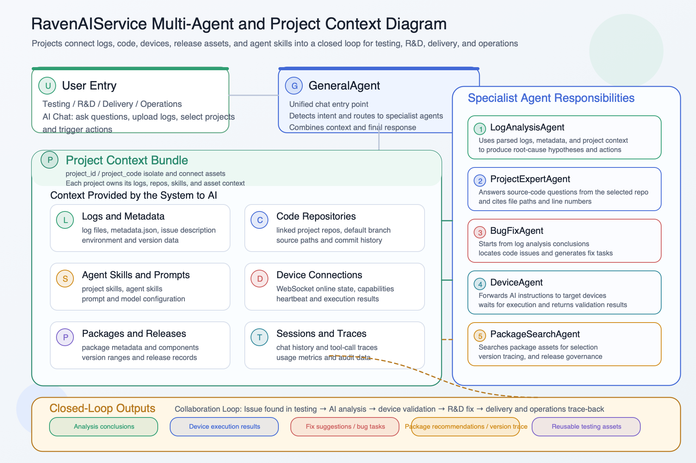

# RavenAIService

[中文](README_ZH.md) | English

> Release, packaging, and Docker workflows are now centralized in [QUICKSTART.md](QUICKSTART.md). Use `scripts/docker-start.sh`, `scripts/docker-stop.sh`, and `scripts/docker-publish.sh`;

RavenAIService is the core service repository of the Raven intelligent testing platform. The platform is evolving from a single-purpose log tool into a multi-project, multi-agent general testing platform, built around **project-based management, multi-agent collaboration, device integration, and version asset governance** for complex testing scenarios.

Logs, AI, devices, code assets, and releases are no longer isolated modules — they are organized by “project” and driven by specialized agents, forming a closed-loop collaboration across testing, R&D, delivery, and operations.



## Product Positioning

Raven focuses on recurring pain points in testing workflows and is evolving toward a true platform:

- logs come from many places and are hard to standardize or reuse
- complex logs are expensive to process and slow to investigate
- troubleshooting is still heavily experience-driven and difficult to scale
- platform workflows and device workflows are disconnected
- packages, releases, and test assets are scattered across tools
- different projects and teams lack a unified testing backbone

RavenAIService is built to turn those fragmented steps into a more complete intelligent testing flow:

- organize logs, code repositories, agent skills, and analysis results around **projects** as the core unit
- use a **multi-agent architecture** (general chat, log analysis, device operations, code expert, bug fix, package search) so each scenario is handled by the most appropriate agent
- automate complex log processing and reduce waiting time
- connect platform and device capabilities into a closed-loop workflow
- centralize software packages and client releases for better governance
- support Chinese / English multi-language UI for global teams

## Platform Value

- **Project-based management**: logs, repositories, and agent skills are organized per project — each team gets its own context
- **Multi-agent collaboration**: general chat, log analysis, code expert, device operations, bug fix, package search — the platform automatically routes to the best agent for each scenario
- **Higher testing efficiency**: logs, AI, devices, and admin workflows live in one place
- **Faster issue turnaround**: teams move from upload to analysis with fewer handoffs
- **Better asset reuse**: logs, analysis results, package data, and actions become reusable knowledge
- **Global support**: the frontend supports Chinese / English switching for multi-language teams

## Typical Scenarios

- Admins create projects for different products / teams, link code repositories, and configure per-project agent skills
- Test teams ingest logs in batches, archived by project, for fast filtering and analysis
- The platform auto-detects different log types and routes them into the right processing flow
- Test and R&D engineers ask questions in AI Chat — GeneralAgent routes to log analysis, code expert, device operations, or other agents as needed
- BugFixAgent takes log analysis conclusions and automatically locates code, generating fix suggestions
- The platform forwards AI instructions to target devices and waits for execution results
- Product versions and delivery packages are managed through one traceable asset center

## Platform Overview

The repository includes these platform modules:

- `FastAPI` main service: core business flows for logs, AI, users, devices, projects, and releases
- `Vue 3 + Vite` console: the unified multi-language web workspace for testers and administrators
- `Multi-agent engine`: GeneralAgent (router), LogAnalysisAgent, DeviceAgent, ProjectExpertAgent, BugFixAgent, PackageSearchAgent
- `Celery + Redis`: asynchronous execution for log processing, AI analysis, and maintenance jobs
- `Nginx`: a single external entry to simplify deployment and access

## Architecture

```text
Browser
  |
  | http://localhost:8085
  v
Nginx
  |-- /                -> Vue SPA (zh/en)
  |-- /api/*           -> FastAPI (8085)
  |-- /raven/api/*     -> FastAPI Raven package API
  |-- /ws/device-link  -> FastAPI WebSocket
  |-- /raven           -> Vue SPA Raven page

FastAPI
  |-- /health
  |-- /api/v1/logs/*
  |-- /api/v1/ai-chat/*       -> multi-agent routing
  |-- /api/v1/users/*
  |-- /api/v1/device-links/*
  |-- /api/v1/releases/*
  |-- /api/v1/projects/*      -> project & repo management
  |-- /api/v1/bug-fixes/*
  |-- /api/v1/metrics/*       -> system & user usage stats
  |-- /raven/api/packages/*
  |-- /admin/*
  |-- frontend/dist static site

Agent Engine
  |-- GeneralAgent          general chat & agent routing
  |-- LogAnalysisAgent      intelligent log analysis
  |-- DeviceAgent           device operation integration
  |-- ProjectExpertAgent    code repository Q&A
  |-- BugFixAgent           bug location & fix suggestions
  |-- PackageSearchAgent    software package search

Celery + Redis
  |-- async log processing
  |-- AI analysis jobs
  |-- scheduled cleanup jobs
```

## Capability Map

### 1. Project-Based Management

- Logs are no longer classified by type alone — they are linked to projects via `project_id` for multi-project isolation
- Each project can be linked to one or more code repositories, providing knowledge sources for the code expert agent
- Per-project agent skill configuration lets admins enable or customize agent behavior for each project
- Admin console provides project repository management, skill configuration, model settings, and usage statistics

### 2. Multi-Agent Collaboration Engine

The platform includes six specialized agents, unified by GeneralAgent routing:

| Agent | Responsibility |
| --- | --- |
| **GeneralAgent** | General chat entry point; automatically routes to specialized agents based on user intent |
| **LogAnalysisAgent** | Intelligent log analysis combining log parsing, metadata, and project context |
| **DeviceAgent** | Connects to devices via WebSocket to execute remote operations and relay results |
| **ProjectExpertAgent** | Answers source-code-level questions based on the project's linked repositories |
| **BugFixAgent** | Starts from log analysis conclusions, locates code issues, and generates fix suggestions |
| **PackageSearchAgent** | Search across software package assets for package selection and version tracing |

- All agents support streaming responses; the frontend renders Markdown and Mermaid diagrams in real time
- AI chat sessions support pinning, Markdown export, drag-and-drop log file upload, and more
- **Agent-driven clarification (AskUserQuestion)**: when a request is ambiguous, the DeviceAgent may decide on its own to ask one or more clarifying questions (each with 2–4 preset options plus free-text input), then continue once answered. It reuses the human-in-the-loop pipeline and the question card survives disconnect/refresh. Users self-manage three preferences in **Settings**:
  - **Globally disable clarification** (on by default): when off, the agent never pauses to ask and proceeds with its own understanding;
  - **Max questions per run** (default 5): beyond the cap the agent decides on its own;
  - **On timeout**: after waiting 5 minutes, either *cancel this run* (default) or *continue with what it knows*.

### 3. Test Log Asset Management

- Supports multiple log upload entry points
- Auto-detects different log types; logs are archived by project
- Extracts `metadata.json` from archives to enrich issue, environment, and version context
- Complex logs are processed asynchronously via Celery with automatic retry on startup
- Provides pagination, filtering, sorting, single download, batch download, and batch delete

### 4. Platform-to-Device Collaboration

- Devices register through `WebSocket /ws/device-link` for a unified connection entry
- The service tracks online state, capability descriptions, and last heartbeat
- DeviceAgent can forward instructions to a specific device and wait for the device response
- Devices can report capabilities so the platform can generate better-matched action chains

### 5. Version Asset Center

- The FastAPI backend handles software package upload, delete, detail, download, and batch download
- Provides package search and filtering API
- Admin UI can upload Linux / macOS / Windows client release artifacts

### 6. Platform Operations and Monitoring

- System-level and user-level AI usage statistics; admins can view agent call trends in the console
- Online editing of prompt configuration, model settings, user management, and release management
- Admin authentication is configured in `app/admin_auth.yaml`

## Repository Layout

```text
RavenAIService/
├── app/                         # FastAPI main service
│   ├── api/                     # HTTP / WebSocket routes
│   ├── agents/                  # multi-agent engine
│   │   ├── general_agent/       #   general chat & routing
│   │   ├── log_analysis/        #   intelligent log analysis
│   │   ├── device_agent/        #   device operation integration
│   │   ├── project_expert/      #   code repository Q&A
│   │   ├── bug_fix/             #   bug fix suggestions
│   │   └── package_search/      #   software package search
│   ├── middleware/              # request logging, file size limits, etc.
│   ├── models/                  # SQLAlchemy and Pydantic models
│   ├── services/                # service layer
│   ├── tasks/                   # Celery tasks
│   ├── tools/                   # log / metadata helpers
│   ├── prompts/                 # prompt configuration
│   ├── config.py                # main config entry
│   └── main.py                  # FastAPI app entry
├── frontend/                    # Vue 3 + Vite frontend (zh/en multi-language)
├── data/                        # local placeholder; container data lives in Docker volumes
├── logs/                        # local placeholder; container logs live in Docker volumes
├── scripts/                     # Docker start/stop/clean/publish scripts
├── alembic/                     # database migrations
├── tests/                       # Python-side tests
├── docker-compose.yml           # unified frontend/backend/task/data orchestration
├── Dockerfile                   # backend and Celery image build
└── QUICKSTART.md                # release, packaging, and Docker workflow guide
```

## Quick Start

See [QUICKSTART.md](QUICKSTART.md) for the full release, packaging, and Docker workflow. The common entry is:

```bash
./scripts/docker-start.sh
```

After startup:

- Main entry: `http://localhost:8085`
- Log platform: `http://localhost:8085/`
- Package center: `http://localhost:8085/raven`
- AI Chat: `http://localhost:8085/ai-chat`
- Admin console: `http://localhost:8085/admin/prompts`
- Health check: `http://localhost:8085/health`
- Swagger docs: `http://localhost:8085/docs` in development only

Common scripts:

```bash
./scripts/docker-logs.sh
./scripts/docker-restart.sh
./scripts/docker-stop.sh
./scripts/docker-publish.sh <dockerhub_namespace> <tag>
```

## Configuration

### Main config files

- `.env`: FastAPI, database, Redis, Celery, LLM, and package management config
- `app/prompts/prompts_config.yaml`: AI prompt configuration
- `app/admin_auth.yaml`: admin accounts and token TTL settings

### Important settings

#### FastAPI / base service

- `ENVIRONMENT`: `development` or `production`
- `PORT`: FastAPI port, default `8085`
- `SERVE_FRONTEND`: whether FastAPI serves `frontend/dist` directly; keep `false` for the standard Docker setup
- `FRONTEND_DIST_DIR`: optional frontend build directory override when `SERVE_FRONTEND=true`
- `MAX_FILE_SIZE`: upload limit, default `1GB`
- `SQLITE_FILE`: default development database path, default `data/logs.db`
- `DATABASE_URL`: preferred if explicitly set
- `CELERY_BROKER_URL` / `CELERY_RESULT_BACKEND`: Celery / Redis setup

#### LLM / AI

- `LLM_PROVIDER`
- `DEEPSEEK_BASE_URL`
- `LLM_MODEL_NAME`
- `LLM_REASONING_MODEL`
- `ANTHROPIC_PROVIDER`: `deepseek | anthropic | custom`, used by the log analysis agent
- `ANTHROPIC_API_KEY`: required for the log analysis agent
- `ANTHROPIC_BASE_URL` / `ANTHROPIC_MODEL`: configure for a custom provider or to override provider defaults
- `PROMPTS_CONFIG_PATH`

#### Raven package management

- `RAVEN_BASE_PATH`: default `/raven`
- `RAVEN_DATA_DIR`: default `data/raven`

## Main Product Entrypoints

| Path | Purpose |
| --- | --- |
| `/workbench` | AI workbench (chat, agent interaction) |
| `/logs` | log list and filtering |
| `/log/:id` | log detail and analysis |
| `/upload` | log upload |
| `/devices` | device list and status |
| `/bug-fixes` | bug fix ticket list |
| `/raven-manager` | software package management |
| `/raven/package/:id` | software package detail |
| `/download` | client download page |
| `/admin/project-repos` | project repository management |
| `/admin/agent-skills` | agent skill configuration |
| `/admin/model-settings` | model settings |
| `/admin/metrics` | usage statistics |
| `/admin/prompts` | prompt admin page |
| `/admin/users` | user admin page |
| `/admin/releases` | release admin page |

## Related Documents

- [QUICKSTART.md](QUICKSTART.md) — release, packaging, and Docker workflow
- [PROJECT_SETUP.md](PROJECT_SETUP.md)
- [DEPLOY_USAGE.md](DEPLOY_USAGE.md)
- [docs/DATABASE_USAGE.md](docs/DATABASE_USAGE.md)
- [docs/API_SUMMARY.md](docs/API_SUMMARY.md)
- [frontend/README.md](frontend/README.md)
