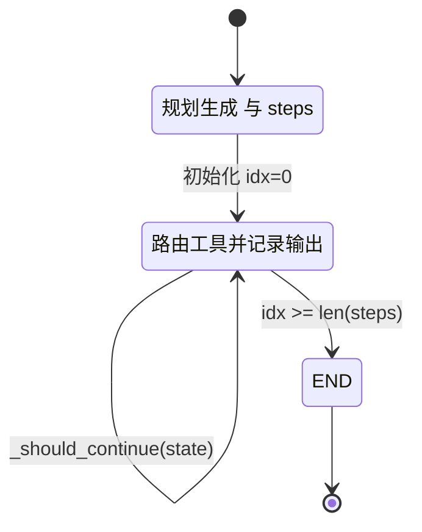
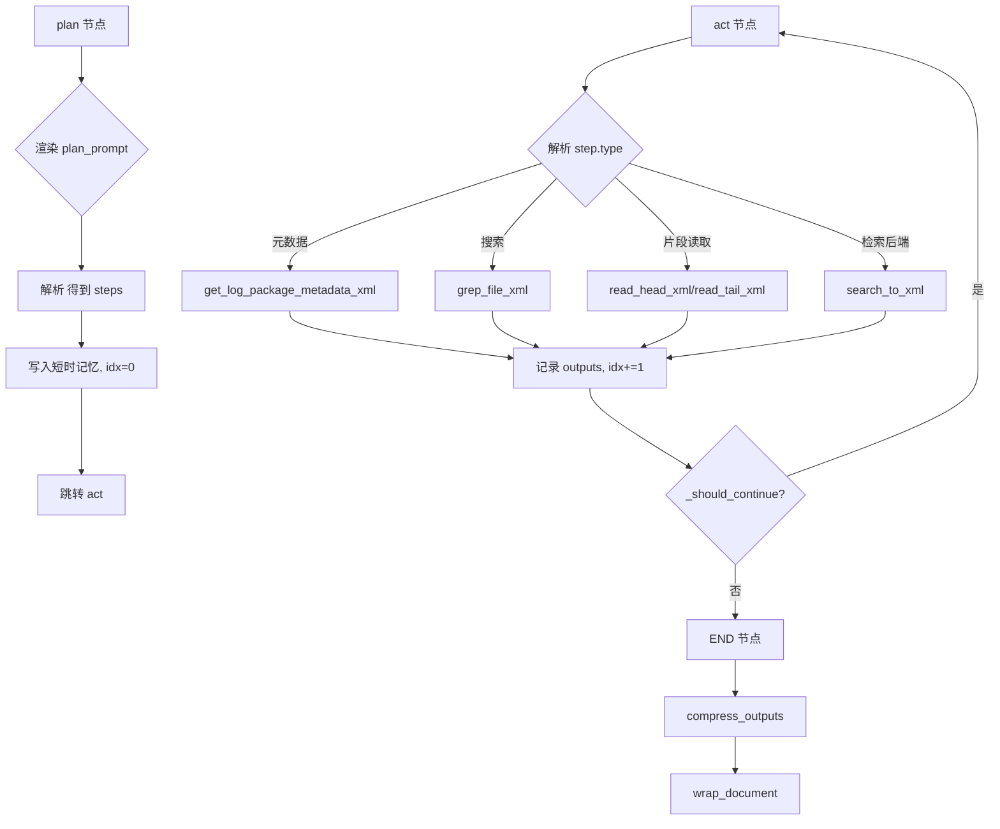
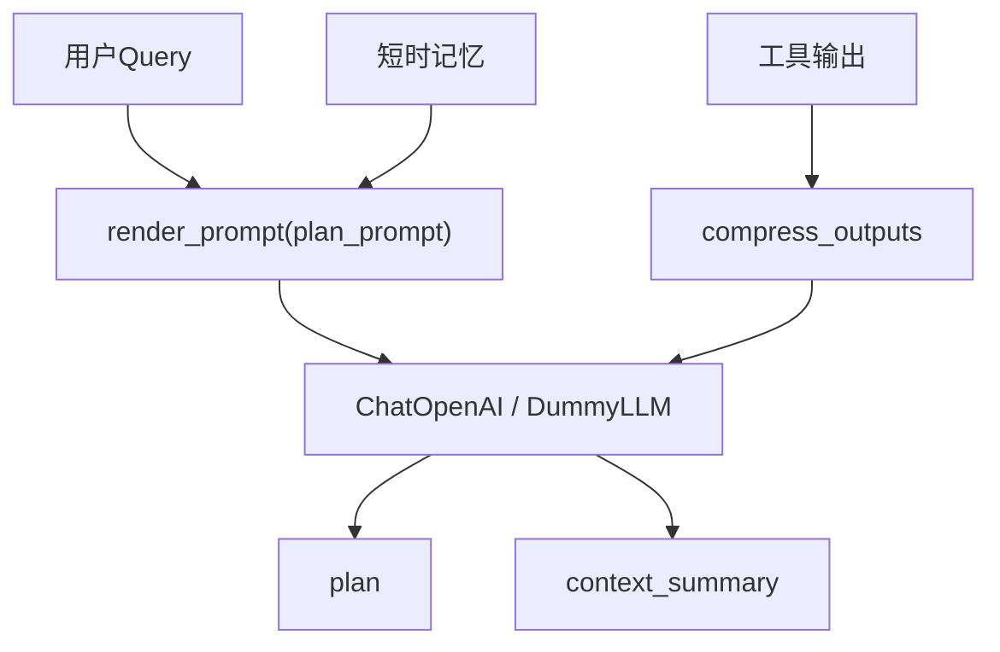

# AI日志分析功能设计与实现文档

本文档系统化说明日志分析Agent的设计目标、架构、关键模块、代码实现细节、上下文管理策略、XML规范、测试与使用方法，以及安全与性能最佳实践。

## 目标与范围
- 面向超大日志：在不读取整文件的前提下进行检索、抽样和片段读取。
- 结构化输出：统一以Claude风格XML标签表达内容与元数据，便于LLM解析与引用。
- 规划与ReAct：具备制定执行计划、工具路由、观察总结的Agent能力。
- 上下文压缩：短时记忆窗口 + LLM摘要/提取式压缩控制上下文规模。
- 可插拔检索：默认本地regex，支持ES/OpenSearch作为后端（可按需接入）。

## 系统架构
- 工具层（`app/tools/`）：
  - `metadata_tool.py`：仅读取压缩包头部，提取文件清单与元数据。
  - `grep_tool.py`：流式grep，控制匹配数与字节上限，带上下文片段。
  - `fs_tools.py`：安全的文件系统操作（listdir/head/tail/chunk/stat/hash）。
  - `search_backend.py`：检索后端接口，内置Regex与ES/OS stub。
- Agent层（`app/agents/`）：
  - `xml_utils.py`：统一XML结构封装（`<log_metadata/>`、`<log_package/>`、`<search_results/>`、`<excerpt/>`、`<plan/>`）。
  - `log_agent.py`：以StateGraph编排ReAct循环（plan→act→条件终止），提供顺序降级、短时记忆注入与上下文压缩，并统一XML输出。

#### LangGraph/StateGraph 特性详解
- 功能描述：基于 LangGraph 的 `StateGraph` 对 Agent 的“规划→行动→观察→循环”进行有向图编排，通过条件边控制回环与终止，支持在缺少 LangGraph 环境时顺序降级执行。
- 日志分析应用案例：处理超大日志压缩包时，先用元数据工具读取归档头，随后按 `<plan/>` 步骤对首个文本文件进行 `grep` 搜索和头尾片段读取，最后压缩上下文并输出统一XML。
- 交互关系：与工具层（`metadata_tool`/`grep_tool`/`fs_tools`/`search_backend`）、短时记忆、LLM提示词管理协同；`_should_continue(state)` 作为唯一循环判定与 LangGraph 节点边的配合点。
- 图解（Mermaid）：

- 性能与最佳实践：将 `steps` 控制在 3–6 步；限制 `agent_max_snippet_bytes` 与 `agent_max_matches` 减少I/O；短时记忆窗口（`agent_short_term_window`）不宜过大；优先本地regex检索以降低延迟；必要时再切换 `agent_search_backend=elasticsearch`。
- 配置与调优：`agent_short_term_window`、`agent_max_snippet_bytes`、`agent_max_matches`、`agent_search_backend`、`elasticsearch_url`、`llm_model_name`、`llm_temperature`；在无 LangGraph 时保持功能一致的顺序降级。
- 常见问题与解决：未安装 LangGraph → `pip install langgraph` 或使用降级路径；循环未终止 → 检查 `_should_continue` 与 `idx` 更新；步骤解析失败 → 回退到默认步骤“读取片段→grep搜索”；ES不可达 → 回退本地regex；LLM限流 → 降低 `llm_temperature` 或回退 `DummyLLM`。
- 配置与依赖：
  - `requirements.txt`：`langchain`、`langgraph`、`openai`、`tiktoken` 等。
  - `app/config.py`：Agent与LLM配置项、检索后端、根目录访问约束。
- 测试与CLI：
  - `test_ai_log_analysis.py`、`simple_test.py`：覆盖工具、Agent、性能。
  - `bin/run_log_agent.py`：命令行运行Agent并打印XML结果。

## 依赖与安装
- 安装：`python -m pip install -r requirements.txt`
- 可选LLM：设置 `OPENAI_API_KEY` 或在 `.env` 中配置；未设置时回退到 `DummyLLM`。

## 配置项（`app/config.py`）
- `agent_enabled`: 是否启用Agent（默认True）。
- `agent_root_dir`: Agent可访问的日志根目录（默认`uploads`）。
- `agent_max_snippet_bytes`: 片段最大字节（默认512KB）。
- `agent_max_matches`: grep最大匹配数（默认50）。
- `agent_search_backend`: `regex | elasticsearch`，默认regex。
- `elasticsearch_url`: ES/OS地址（如需接入）。
- `llm_provider`: `openai`（可扩展为其他）。
- `openai_api_key`、`llm_model_name`、`llm_temperature`：LLM配置。
- `agent_short_term_window`: 短时记忆窗口消息条数（默认5）。

## 关键模块与代码说明
### XML工具（`app/agents/xml_utils.py`）
- 目的：统一结构化输出，便于LLM解析与上下游消费。
- 主要函数：
  - `wrap_metadata(dict)` → `<log_metadata>`：元数据封装。
  - `wrap_file_list(files, source)` → `<log_package>`：压缩包文件清单。
  - `wrap_search_results(query, results)` → `<search_results>`：检索结果。
  - `wrap_excerpt(path, start_line, end_line, snippet, match)` → `<excerpt>`：日志片段。
  - `wrap_plan(steps)` → `<plan><step id="1">...</step></plan>`：规划。

### 元数据工具（`app/tools/metadata_tool.py`）
- 设计要点：
  - 支持 `.tar.gz/.tgz/.zip`，仅读取归档头，不解压全量内容。
  - 严格根目录检查 `_is_in_allowed_root` 防止越权访问。
- 主要函数：
  - `get_log_package_metadata(path)`：返回 `{metadata, files}`。
  - `get_log_package_metadata_xml(path)`：输出 `<log_package_info>`，内含 `<log_metadata>` 与 `<log_package>`。

### grep工具（`app/tools/grep_tool.py`）
- 设计要点：
  - 逐行流式搜索，限制 `max_matches`、`max_bytes`，并提供前后文行数 `context`。
- 主要函数：
  - `grep_file(path, query, context, max_matches, max_bytes)`：返回结构化结果。
  - `grep_file_xml(...)`：输出 `<grep>`，含 `<search_results>` 与多段 `<excerpt>`。

### 文件系统工具（`app/tools/fs_tools.py`）
- 设计要点：
  - `safe_listdir(root, include_glob, max_depth)`：限制深度与根目录。
  - `read_head_xml`/`read_tail_xml`/`read_chunk_xml`：仅读小片段，避免OOM。
  - `stat_xml`/`sha256_xml`：文件统计与校验。
- 所有入口均做 `_is_in_allowed_root` 检查。

### 检索后端（`app/tools/search_backend.py`）
- 接口：`SearchBackend.index(paths)`、`SearchBackend.search(query, k)`。
- `RegexSearchBackend`：本地实现，结合 `grep_file` 做抽样匹配。
- `ElasticSearchBackend`：轻量stub，若存在客户端与URL则调用ES/OS `search`。
- `search_to_xml(...)`：标准化输出 `<search_results>`。

### Agent（`app/agents/log_agent.py`）
- 总览：以 ReAct 风格的“规划→行动→观察→循环”作为核心能力，由 LangGraph 的 `StateGraph` 编排控制；在不具备 LangGraph 运行环境时自动降级为顺序执行。
- Graph结构：
  - 节点：`plan`（生成XML计划）、`act`（按步骤调用工具并记录观察）。
  - 条件边：`act` 节点通过 `_should_continue(state)` 决定继续回到 `act` 或终止到 `END`。
  - 入口：`graph.set_entry_point("plan")`，首次执行一定先进行规划。

#### 节点详细设计（plan/act/END）
- 节点功能定位与职责
  - plan：生成结构化 `<plan/>` 与 `steps`，初始化 `idx=0` 并写入短时记忆。
  - act：按 `steps[idx]` 路由工具，采集输出XML片段并更新记忆与 `idx`。
  - END：聚合 `outputs`、压缩上下文、封装为 `<document/>` 返回。

- 输入/输出数据格式
  - plan 输入：`query`、`hints`、`<short_term_memory/>`；输出：`plan_xml`（`<plan>`）、`steps`（数组）。
  - act 输入：`query`、`hints`、`steps[idx]`；输出：工具XML片段（如 `<grep/>`、`<reads/>`、`<log_package_info/>`），追加到 `outputs`。
  - END 输入：`outputs` 列表；输出：`<document><content>...</content><meta>...</meta></document>`。

- 处理流程与算法

- 性能指标与资源消耗
  - plan：LLM调用开销（0–2K tokens），CPU轻；无LLM时几乎零开销。
  - act：I/O为主；`grep_file_xml` 受 `agent_max_matches` 与 `max_bytes` 限制；片段读取上限 `agent_max_snippet_bytes`。
  - END：摘要与聚合；LLM摘要消耗 0–1K tokens；整体输出大小与步骤数线性相关。

- 异常处理与容错
  - LLM不可用/解析失败：使用默认计划“读取片段→grep搜索”，并记录错误为 `<document>` 子元素。
  - 文件越权/不存在：由 `_is_in_allowed_root` 拦截并返回错误XML；继续执行后续步骤或终止。
  - 正则非法：捕获异常，返回提示并继续下一步。
  - 后端不可达：`search_backend` 自动回退到本地regex。

- 节点交互协议与依赖
  - plan 依赖 `render_prompt`、短时记忆、`xml_utils.wrap_plan`。
  - act 依赖工具层四类入口与 `hints`；输出统一追加到 `outputs`。
  - END 依赖 `compress_outputs` 与 `xml_utils.wrap_document`；统一来源标注 `{source: "log_agent"}`。

- 可扩展性设计与配置
  - 新增 step.type（如 `index_archive`、`semantic_search`）可通过 `_execute_step` 分支扩展，保持XML一致。
  - 配置项：`agent_short_term_window`、`agent_max_snippet_bytes`、`agent_max_matches`、`agent_search_backend`、`llm_model_name`、`llm_temperature`。
  - 建议引入 `max_steps` 与 `step_timeout`（与业务配置对齐）以进一步增强可控性。

- 状态模型：
  - `AgentState(TypedDict)`：`query`、`hints`、`plan_xml`、`steps`、`idx`、`outputs`、`done`。
  - 流转：`plan` 生成 `plan_xml/steps` 并初始化 `idx=0`；`act` 执行 `steps[idx]`、追加 `outputs` 并自增 `idx`；当 `idx>=len(steps)` 时进入 `END`。
- 规划阶段：
  - `plan(query)`：使用 `render_prompt("plan_prompt", memory_context, user_query)`；保证输出为 `<plan><step>...</step></plan>`；若无步骤则补默认：`读取片段→grep搜索`。
  - 记忆注入：将用户 `query` 与生成的 `plan_xml` 写入 `ShortTermMemory`；`context()` 以 `<short_term_memory>` 形式进入提示词。
- 执行阶段（工具路由）：
  - `_execute_step(step, query, hints)`：根据步骤语义分支调用：
    - 元数据：`get_log_package_metadata_xml(path)`（支持 `.tar.gz/.tgz/.zip` 的头部解析）。
    - 搜索：`grep_file_xml(path, pattern, context=2)`；无路径时自动选取首个文本文件。
    - 片段读取：`read_head_xml/read_tail_xml` 合并为 `<reads>` 输出。
    - 检索后端：`search_to_xml(self.search_backend, query, k=10)` 作为兜底。
  - `hints`：支持覆盖 `archive_path`、`path`、`pattern` 等，提高工具召回与精度。
- 记忆与压缩：
  - 每步输出经 `memory.add_summary(xml)` 记录；最终由 `compress_outputs(outputs)` 进行提取式压缩 + 可选LLM摘要，产出 `<context_summary>`。
- 运行与降级：
  - `run(query, hints)`：有 LangGraph 时通过 `self._app.invoke(state)` 执行完整循环；无 LangGraph 时降级为“顺序：plan→逐步执行”。所有结果最终统一 `wrap_document(..., {source: "log_agent"})`。
- LLM与Prompt：
  - `get_llm()`：优先 `ChatOpenAI`（支持自定义 `base_url` 与 DeepSeek 兼容），缺省回退到 `DummyLLM.predict` 保持可用性与可测性。
  - Prompt管理：支持 `prompts_config.yaml/json`；若 `langchain.PromptTemplate` 不可用则安全降级为 `str.format`。

#### LangChain PromptTemplate 与 ChatOpenAI 详解
- 功能描述：使用 LangChain 的 `PromptTemplate` 管理可配置提示词，并通过 `ChatOpenAI` 调用模型生成结构化XML（如 `<plan/>`、`<context_summary/>`）；在依赖不可用时自动回退到 `str.format` 与 `DummyLLM`，保证可测性。
- 日志分析应用案例：`plan(query)` 渲染 `plan_prompt` 注入 `<short_term_memory>` 与用户 `query`，产出 `<plan/>`；完成各步后使用 `compress_outputs(outputs)` 触发 LLM 生成提取式摘要 `<context_summary/>`。
- 交互关系：与短时记忆、`xml_utils`、工具层输出协同，确保 LLM 只接收必要上下文；与搜索后端的结果共同形成最终文档。
- 图解（Mermaid）：

- 性能与最佳实践：控制提示词与上下文总tokens（建议 ≤2K），将 `llm_temperature` 设置为 0–0.3 保持确定性；在不可用或限流时回退到 `DummyLLM` 并只做提取式压缩。
- 配置与调优：`llm_provider`、`openai_api_key`、`llm_model_name`、`llm_temperature`、可选 `base_url`（兼容 DeepSeek）；提示词来自 `prompts_config.yaml/json`。
- 常见问题与解决：API Key 缺失/网络异常 → 检查环境变量与代理；`PromptTemplate` 不可用 → 使用 `str.format`；输出XML不规范 → 在解析失败时做容错并回退默认计划；模型限流 → 降低温度与上下文长度或切换本地压缩流程。
- 检索后端：
  - `RegexSearchBackend` 为默认；可切换 `ElasticSearchBackend(url)`；初始化时进行受限 `index(paths≤5000)`，提升首次搜索体验。
- 终止与鲁棒：
  - `_should_continue(state)` 作为循环控制的单一判定；所有工具错误统一封装为 `<document>` 子元素，保证链路无异常崩溃。

### CLI（`bin/run_log_agent.py`）
- 用法：
  - `python bin/run_log_agent.py --query "提取元数据并搜索ERROR" --hint-archive uploads/ai_test_logs.tar.gz --hint-path uploads/application.log --hint-pattern "ERROR"`
- 输出：统一XML文档，含规划、各工具结果、上下文摘要。

## 数据流与ReAct过程
- 输入：`query` 与可选 `hints`（如 `archive_path`、`path`、`pattern`）。
- 状态初始化：构造 `AgentState`（含 `plan_xml/steps/idx/outputs/done`），入口指向 `plan`。
- 规划节点（plan）：渲染 `plan_prompt`（注入 `<short_term_memory>`），产出 `<plan><step>...</step></plan>` 并解析为 `steps`。
- 行动节点（act）：根据当前 `idx` 执行对应工具，写入 `outputs` 并更新 `memory.add_summary(...)`。
- 循环控制：`_should_continue(state)` 判断 `idx < len(steps)` 则继续 `act`，否则到 `END` 终止。
- 压缩与聚合：`compress_outputs(outputs)` 生成 `<context_summary>`；最终 `wrap_document(outputs + summary)` 作为统一结果返回。
- 顺序降级路径：若 `StateGraph` 不可用，按“plan→逐步执行”顺序完成，并保持相同的XML聚合与压缩逻辑。

## XML规范要点
- 顶层文档：`<document><content>...工具输出...</content><meta>...</meta></document>`。
- 计划：`<plan><step id="1">...</step>...</plan>`。
- 元数据：`<log_metadata>`；文件清单：`<log_package>`。
- 检索：`<search_results query="...">...</search_results>` 与 `<excerpt>`。
- 上下文摘要：`<context_summary>`；短时记忆：`<short_term_memory>`。

## 安全与性能最佳实践
- 只读访问：所有文件必须位于 `agent_root_dir` 内；拒绝越权。
- 限流：片段字节与匹配数限制；目录遍历限制最大深度与总数量。
- 流式处理：避免将整文件加载到内存；grep与head/tail均为流式或分块。
- 检索后端：本地regex为默认；ES/OS建议外部摄入并按需接入。

## 测试与使用
- 参考：`AI_LOG_ANALYSIS_TESTING_GUIDE.md`、`AI_LOG_ANALYSIS_TESTING_METHODS.md`。
- 运行：
  - `python test_ai_log_analysis.py --test-type unit|integration|performance`
  - `python simple_test.py --test-type unit|all`
- 快速试用（CLI）：见上文命令示例。

## 集成建议
- FastAPI：新增 `/api/v1/agent/analyze` 接口，接受 `query` 与 `hints`，返回XML/JSON。
- 前端：在 `LogDetail.vue` 中增加“AI分析”面板，展示 `<plan>` 与片段/摘要，支持复制与导出。

## 常见问答（路径与解压）
- 路径指定：`app/config.py` 的 `settings.agent_root_dir` 决定Agent允许访问的根目录（默认 `uploads`）。在 `app/agents/log_agent.py` 的 `_execute_step(...)` 中，元数据步骤使用 `hints['archive_path']` 指定包路径（未提供则回退 `os.path.join(settings.agent_root_dir, "logs.tar.gz")`）；grep/读取步骤使用 `hints['path']` 指定文件路径（未提供时扫描根目录的 `.log/.txt`）。CLI `bin/run_log_agent.py` 支持 `--hint-archive`、`--hint-path` 注入上述 hints。
- 解压位置：此前仅读取归档头不解压（`app/tools/metadata_tool.py`）。现新增 `app/tools/archive_tool.py` 的 `safe_extract_archive(...)`，将顶层归档安全解压到 `uploads/_extracted/<name>-<uuid>/`，并通过 `list_tree_xml(...)` 输出树结构。
- 文件清单提供：未解压时，`get_log_package_metadata_xml(path)` 输出 `<log_package_info>`（含 `<log_metadata>` 与 `<log_package>`）；解压后，`list_tree_xml(extracted_dir)` 输出 `<log_package>` 树状文件列表，供模型决策。
- 嵌套解压能力：新增 `find_nested_archives(...)` 与 `extract_nested_archive_xml(...)` 实现解压目录内的嵌套归档发现与按需继续解压；Agent步骤已支持“解压/树结构/解压子包”。

## 自动解压预处理与树结构
- 触发条件：`LogAnalysisAgent.run(...)` 检测到 `hints['archive_path']` 为 `.tar.gz/.tgz/.zip` 即自动解压。
- 解压位置：`uploads/_extracted/<basename>-<uuid>`，确保位于 `agent_root_dir` 内以通过安全校验。
- 输出结构：产出 `<document type="extraction">`，包含 `<log_metadata archive_path/extracted_dir>` 与 `<log_package>` 树列表（默认深度2）。随后进入 `plan→act` 流程，模型可据此选择文件。
- 嵌套策略：默认仅扫描并列出嵌套归档为 `<nested_archives>`；若模型在后续步骤传入 `nested_path`，则调用 `extract_nested_archive_xml(...)` 解压该子包并返回其树结构。
- 安全约束：严格根目录校验 `_is_in_allowed_root`、安全路径拼接防路径穿越、忽略设备文件/符号链接。

## 未来扩展
- 工具调用：使用函数调用式路由（OpenAI工具调用/JSON模式）提升召回与准确性。
- 双检索：加入向量检索（FAISS/Chroma） + 关键词检索的混合策略。
- 归档内grep：在压缩包成员级别进行流式匹配（tar/zip内文件）。
- 观察链路：将每步输出与模型思考过程持久化便于复盘与优化。